# [Foundations](https://www.linkedin.com/learning/applied-machine-learning-foundations/leveraging-machine-learning?autoAdvance=true&autoSkip=false&autoplay=true&resume=true)

## Introduction

### [Leveraging Machine Learning](https://www.linkedin.com/learning/applied-machine-learning-foundations/leveraging-machine-learning?autoAdvance=true&autoSkip=false&autoplay=true&resume=true)

- The amount of data generated by machines and humans is mind-boggling and it's growing faster than it ever has
- According to IBM, 90% of the data ever created was created in the last two years
- The challenge is that a lot of this data is completely unstructured and really messy
- Maybe there simply is just too much data to even know how to extract the value out of it

### [What you Should Know](https://www.linkedin.com/learning/applied-machine-learning-foundations/what-you-should-know?autoAdvance=true&autoSkip=true&autoplay=true&resume=false)

What you should know to get the most out of this course:
- [x] Basic Python knowledge
- [x] Basic experience with NumPy, pandas, and scikit-learn

Helpful to Have:
- [x] Basic statistics
- [x] Entry-level data analysis experience
- [x] Familiarity with common machine learning terms

### [What Tools you Need](https://www.linkedin.com/learning/applied-machine-learning-foundations/what-tools-you-need?autoAdvance=true&autoSkip=true&autoplay=true&resume=false)
- Python 3.7
- Jupyter Notebook
- Anaconda3 installation (version 4.5.12) will include all dependencies needed for this course

### [Using the Exercise Files](https://www.linkedin.com/learning/applied-machine-learning-foundations/using-the-exercise-files?autoAdvance=true&autoSkip=true&autoplay=true&resume=false)

You are highly encouraged to download and use the exercise files to follow along. Also recommend playing with the code by tweaking it and maybe even purposely breaking it, so you can test the bounds and find out why it did not work.

- The exercise files are broke down into chapters
- Chapter folders are organized into individual lessons
- Within each lesson, there is a `start` folder and an `end` folder
- The start folder contains the notebook that you should start coding in
- The end folder will contain the completed notebook just for your reference
- There is only one dataset for the entire course, and it is in the root directory

## Machine Learning Basics

### [What is Machine Learning?](https://www.linkedin.com/learning/applied-machine-learning-foundations/what-is-machine-learning?autoAdvance=true&autoSkip=true&autoplay=true&resume=false)

If you ask 10 data scientists to define machine learning, you might get 10 different answers. But they will revolve around some key themes.

> "Field of study that gives computers the ability to learn without being explicitly programmed." 
> 
> --- Arthur Samuel, IBM, 1959

- Arthur Samuel is recognized as one of the first real machine learning pioneers
- He was actually the first to coin the term machine learning
- His definition is a bit vague and seems a bit magical, so let's look at another one...

> "Machine learning algorithms can figure out how to perform important tasks by generalizing from examples."
> 
> --- Pedro Domingos, University of Washington

- This definition hits on one key concept that is missing from the previous definition:
  - "generalizing from examples"

> "Machine learning is fitting a function to examples and using that function to generalize and make predictions about new examples"
> 
> --- Derek Jedamski, Instructor of this Course

- This hits on the fact the algorithm, machine learning model, is based on the data that you feed it that's learning from examples and that the entire goal is to use that learned model to make predictions about new examples
- In other words, machine learning models learn from trends in past data to make predictions about future data

### [What Kind of Problems can this Help you Solve?](https://www.linkedin.com/learning/applied-machine-learning-foundations/what-kind-of-problems-can-this-help-you-solve?autoAdvance=true&autoSkip=true&autoplay=true&resume=false)

There are two high-level questions that first need to be asked in order to determine if the problem can be solved with ML:
- Is this a type of problem that can be solved using ML?
  - Does it require a prediction or bucketing something into categories?
    - If neither one of these apply then this is not a problem that can be solved with ML
  - Is the problem relatively self-contained?
    - It there are too many additional or outside factors, there will be too much noise to actually make an accurate prediction

- Is this particular problem one that can be solved with ML?
  - Do I have data with labels?
    - If you don't have labels for your examples, the model can't learn from the past data
  - 
    - Even if you have labels, it can still be relatively complex to determine the accuracy of the model
  - Can I determine an acceptable accuracy threshold?
    - You should be able to tie the model performance to the cost or savings of some sort
    - In other words, do I understand the business impact of this model?
      - What is the break even point?
      - What would even be considered a success?

Break down the questions into a flowchart:
1. Does it require a prediction or bucketing something into categories?
   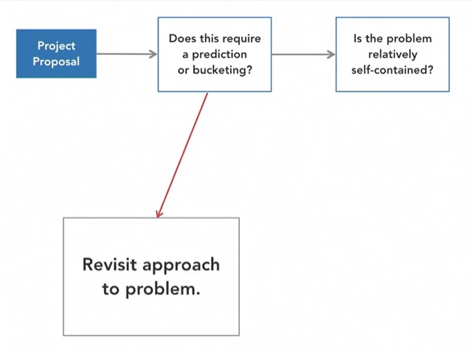

2. Is the problem relatively self-contained?
   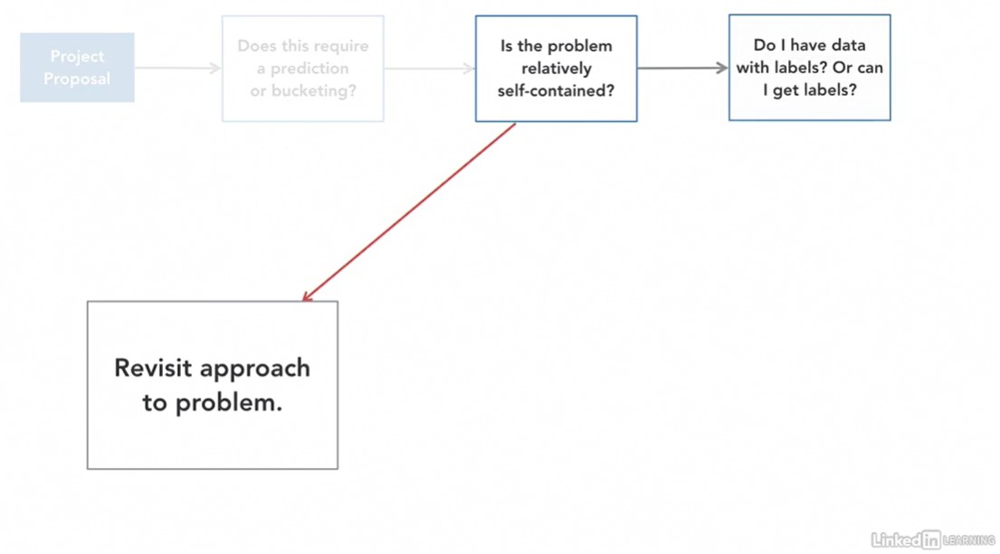

3. Do I have data with labels?
   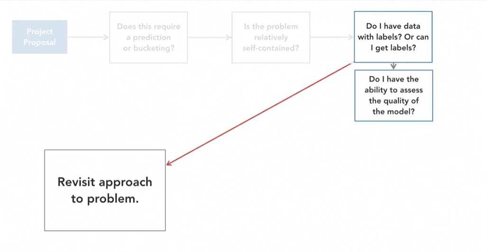

4. Do I have the ability to assess the quality of the model?
   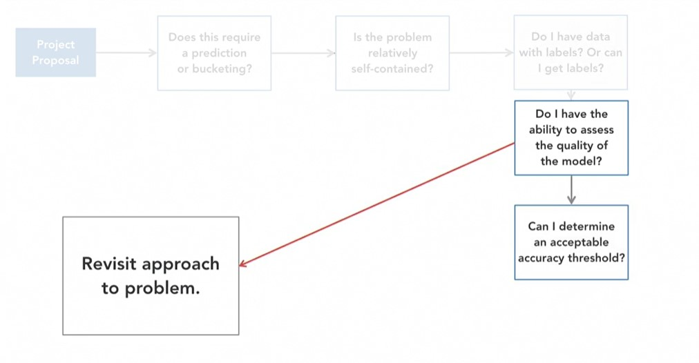

5. Can I determine an acceptable accuracy threshold?
   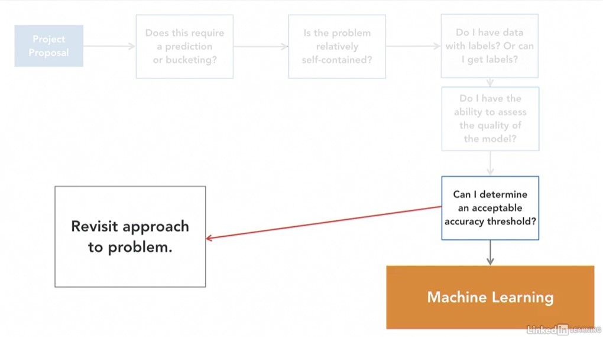

### [Why Python](https://www.linkedin.com/learning/applied-machine-learning-foundations/why-python?autoAdvance=true&autoSkip=true&autoplay=true&resume=false)

- Very popular right now and has a large user base
- With a large user base, means nice documentation, lots of quality tutorials, and a lot of activity on Stack Overflow
- Has more machine learning packages than any other language
- Fairly easy to learn and it's remarkably easy to work with, especially in those machine learning packages
- The barrier to entry is quite low
- Python is like a Swiss Army Knife when it comes to data
  - Has very easy to use packages for pretty much anything you'd like to do
  - Classic machine learning: `scikit-learn`, `LightGBM`, `SciPy`
  - Deep learning: `TensorFlow`, `PyTorch`, `keras`
  - Natural Language Processing (NLP): `NLTK`, `genism`
  - Image recognition: `OpenCV`, `scikit-learn`
  - Data visualization: `Matplotlilb`, `Seaborn`
  - Data analysis: `pandas`, `NumPy`

### [Machine Learning vs Deep Learning vs Artificial Intelligence](https://www.linkedin.com/learning/applied-machine-learning-foundations/machine-learning-vs-deep-learning-vs-artificial-intelligence?autoAdvance=true&autoSkip=true&autoplay=true&resume=false)

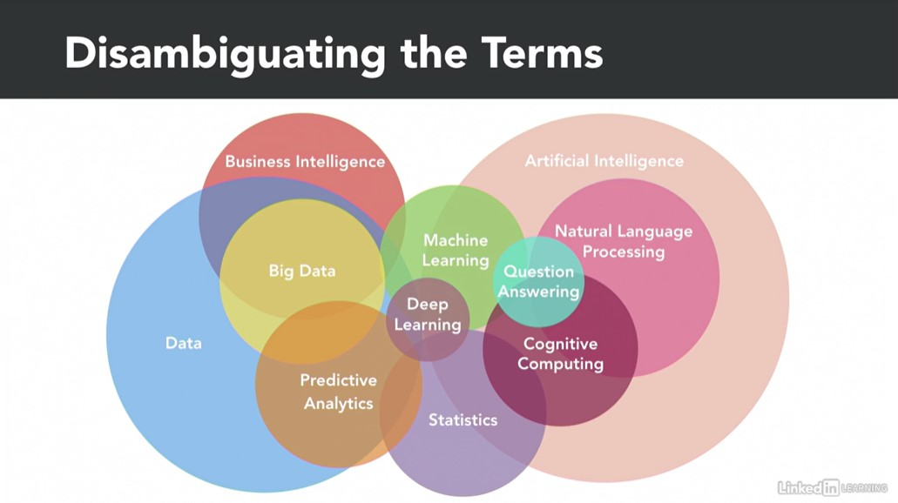

**Machine Learning:**
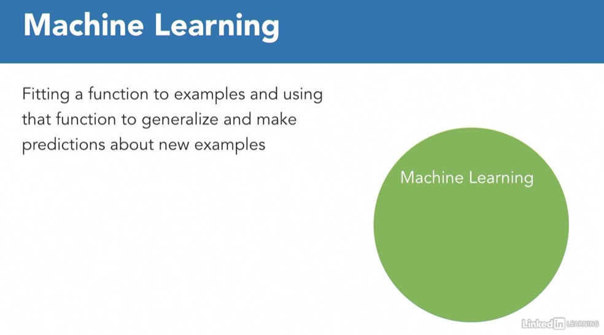
- AKA: Pattern Matching

**Deep Learning:**
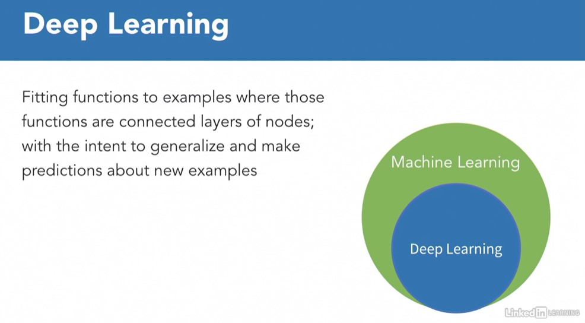
- AKA: Connected pattern matching
- It is still fitting a function to examples, but the difference comes in the fact that these functions are then organized as connected layer of nodes
- In other words, you will have many function connected together in one network where each function is responsible for a very specific thing
- This is still all with the goal to generalize and make predictions about new examples using our network of functions

**Artificial Intelligence:**
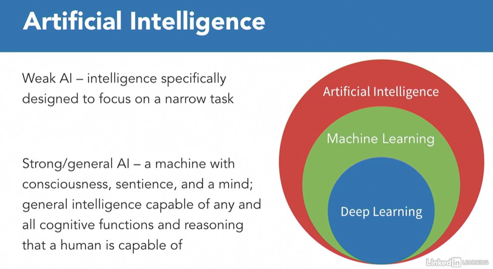
- A superset of machine learning and deep learning
- There are two types of AI:
  - **Weak AI:** Intelligence specifically designed to focus on a narrow task
    - Basically machine learning
    - Example: identifying fraudulent credit card charges

  - **Strong / General AI:** A machine with consciousness, sentience, and a mind; general intelligence capable of any and all cognitive functions and reasoning that a human is capable of
    - A superset of many things
    - Only one of those things happens to be machine learning
    - There are many things under the umbrella of AI that is not machine learning

### [Demos of ML in Real Life](https://www.linkedin.com/learning/applied-machine-learning-foundations/demos-of-machine-learning-in-real-life?autoAdvance=true&autoSkip=true&autoplay=true&resume=false)

- Personal assistants: Siri, Google Home, Amazon Echo
  - All the speech recognition software for these devices is built using machine learning
    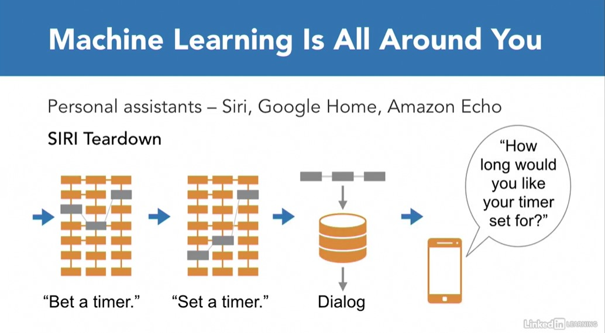

- Recommendation systems: Amazon, Netflix, Facebook, Twitter
  - All of these systems are driven by machine learning
  - One example is using ***collaborative filtering***
    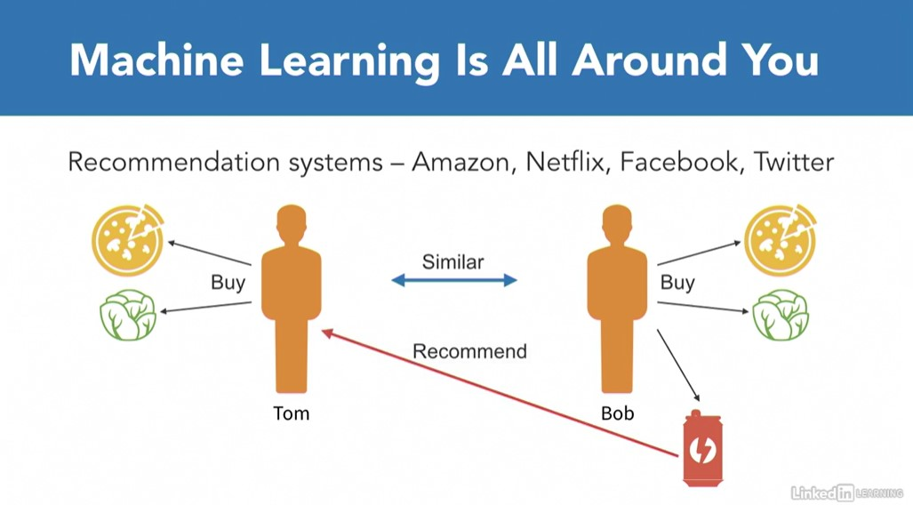
    - **Collaborative Filtering:** Uses similarities between users to make recommendations
    - In the example above:
      - Both Tom and Bob have bought and enjoyed pizza and salad
      - Based on their purchase and rating history, we know that they have similar taste
      - Bob has also bought and enjoyed a soda but Tom has not
      - So the system should recommend soda to Tom

- Ride-sharing: Uber, Lyft
  - There are a number of ways in which machine learning can be used
    - Route efficiency based on traffic
    - Driver-ride pairings based on the following to determining efficient ways to pair two riders together for UberPool:
      - Rider location
      - Driver location
      - Traffic
    - Optimal pricing based on demand of users and supply of drivers to keep the appropriate balance
  - Uber has made all their traffic data publicly available and has built this really neat tool called "Uber Movement"
    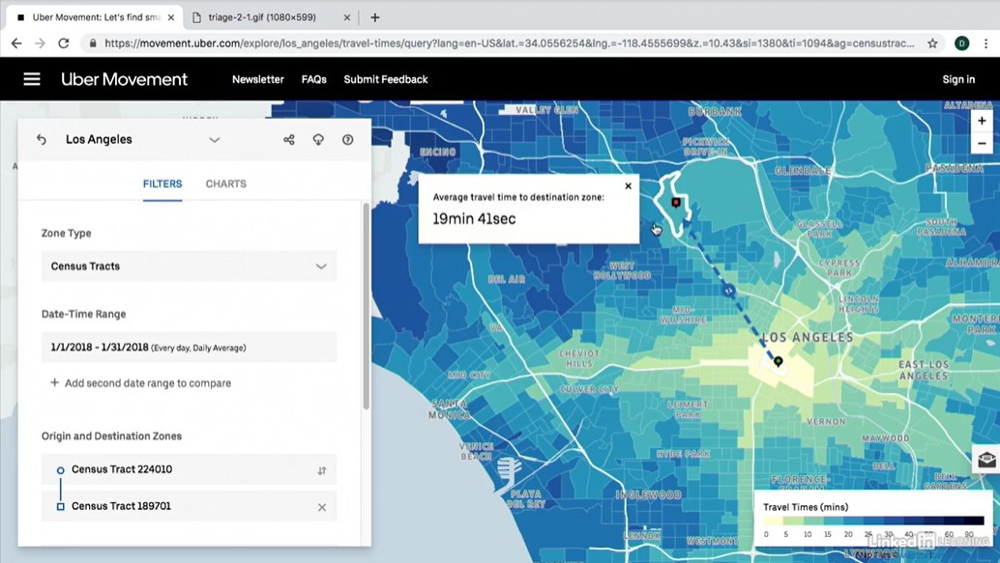
    - It shows how long it would take to get to different areas of a number of different cities given the time of day, day of week, and things like that
    - The colors correspond to travel times and you can click around to see how long it takes to get to different areas

- Self-driving Cars:
  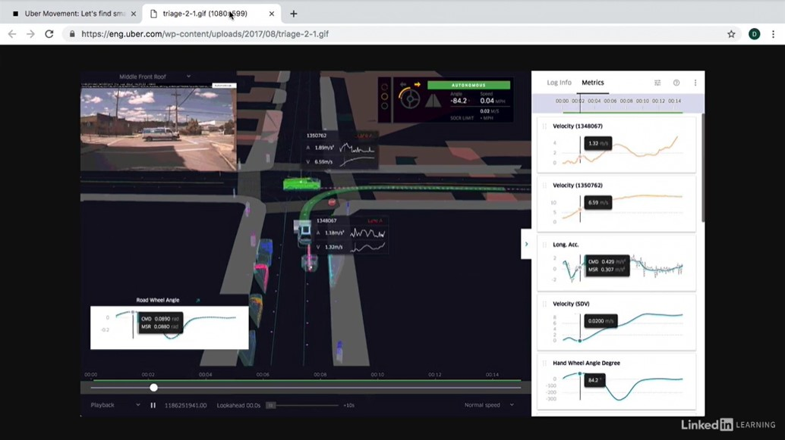 
  - This is using deep learning, which is just a sub-set of machine learning

### [Common Challenges](https://www.linkedin.com/learning/applied-machine-learning-foundations/common-challenges?autoAdvance=true&autoSkip=true&autoplay=true&resume=false)

Common challenges tend to fall into four high-level categories:

- **Problem Scoping**
  - The right problem is not being solved
    - Being able to translate an actual business problem into data and then into a model that will actually solve that exact problem isn't always as easy as it would seem
  - Tolerance threshold is undetermined
    - If you don't understand the impact on the business, then you can't translate it into one acceptable level of accuracy as for the model
    - This is critical to understand before you can even consider deploying a model
  - Impact in real environment can't be measured
    - Often times it is a huge challenge to properly gauge the impact the model will have once it actually goes live in a production system

- **Data**
  - Lack of data / data sensitivity
    - Even in the world of big data, it is actually a very common problem to not have enough data
    - You need enough data to pick up on the underlying pattern in the data
  - Too much data
    - Data is big when managing the data becomes part of the actual problem
  - Data doesn't have labels
    - If you don't have labels, the model simply can't learn the pattern that you want it to learn
    - Sometimes this requires hand labeling, or sometimes you can determine some proxy for the label in an automated way
  - Data is too biased, dirty, noisy, incomplete, etc.
    - You will have to spend a large chunk of your time cleaning your data
    - This is a very common problem

- **Infrastructure**
  - Lack skills to robustly automate
    - Often when models are used in business, they are plugged into an environment where they're run in real time
    - It is quite uncommon to have someone that has the skill to build a quality machine learning model while also having the skills to build out the system to run the model in real time
    - Not enough compute power
      - This is especially a problem in the world of big data
      - When you have TBs of data to process, you need a lot of compute power, and you have to be very careful about how you write your code to make sure it's efficient
    - Inability to A/B test with existing solution
      - You ideal want to test your model in the live environment against whatever mechanism is currently governing the process that this will plug into
    - Inability to continuously track model quality
      - Once the A/B testing stage has passed that you will want to track the model performance over time to make sure that you're not seeing model degradation
      - A lot of places do not have anything in place for this type of tracking

- **Latency**
  - Model takes too long to train
    - This can relate back to having too much data or not having enough compute power for the data you have
    - If a model takes days to train, that can be really difficult to iterate and improve
    - You need to plan your time very carefully when this challenge comes into play
  - Model takes too long at inference time
    - **Inference Time:** When the model's deployed and needs to make real-time decisions

### [Chapter Quiz](https://www.linkedin.com/learning/applied-machine-learning-foundations/quiz/urn:li:learningApiAssessment:4586348?autoAdvance=true&autoSkip=true&autoplay=true&resume=false)

What is one of the key purposes of machine learning?

- [ ] clean up messy data

- [ ] memorize training examples

- [x] generalize to unseen examples

Which is NOT a reason why we use Python for machine learning?

- [ ] It's popular and has a large user base.

- [x] It's the fastest language available.

- [ ] It offers more machine learning packages than any other language.

- [ ] It's easy to learn and work with.

Which is NOT accurate?

- [x] Strong AI is the equivalent of machine learning.

- [ ] Deep learning is a subset of artificial intelligence.

- [ ] Deep learning is a subset of machine learning.

- [ ] Weak AI is the equivalent of machine learning.

## Exploratory Data Analysis and Data Cleaning

### [Why do we Need to Explore and Clean our Data?](https://www.linkedin.com/learning/applied-machine-learning-foundations/why-do-we-need-to-explore-and-clean-our-data?autoAdvance=true&autoSkip=true&autoplay=true&resume=false)

**Why EDA (Exploratory Data Analysis)?**
- Understand the shape of the data
- Learn which features might be useful
- Inform the cleaning that will come next
- Imagine this stage as building the foundation for the house that you are going to build on top of it
- Without a firm handle on what this data looks like, your foundation is going to be shaky
- The house (model) built on top of it will likely end up suboptimal

**What do we do during EDA?**
- There are so many different paths to go down depending on your data
- Counts or distributions of all variables to understand the shape
- Look at the data type for each feature
- Check for missing data
- Understand correlations between your features
- Identify duplicates in the data
- You usually head into EDA with a few key questions that you want to answer but you often allow the data to take you where you need to go within some constraints
- It is important to have structure but be flexible enough to dig into areas that you hadn't planned on looking at before you actually got your hands on the data

**Why Data Cleaning?**
- ML models are not magic
- ML models are algorithms that respond in a systematic way to the data that you give it
- If you give it biased data, you'll get a biased model
- If you give it incomplete data, it will return weak predictions
- It prepares the data in the best way possible to allow the model to pick up on underlying patterns that we want it to fit to
- Shape the data in a way a model can best pick up on the signal
- Remove irrelevant data
- Adjust features to be acceptable for a model

**What do we do during Data Cleaning?**
- Anonymize your data
  - There are heavy regulations on data privacy, so generally you should be removing any personal identifiers from your data it this isn't publicly-available data
- Encode categorical variables
- Fill in missing data (if necessary)
- Prune / scale data to account for skewed data / outliers

### [Exploring Continuous Features](https://www.linkedin.com/learning/applied-machine-learning-foundations/exploring-continuous-features?autoAdvance=true&autoSkip=true&autoplay=true&resume=false)

Work for this section done in the notebook in the [exercise section](foundations/02_EDA/02_03/Start/02_02%20-%2002_03.ipynb)

### [Plotting Continuous Features](https://www.linkedin.com/learning/applied-machine-learning-foundations/plotting-continuous-features?autoAdvance=true&autoSkip=true&autoplay=true&resume=false)

Work for this section done in the notebook in the [exercise section](foundations/02_EDA/02_03/Start/02_02%20-%2002_03.ipynb)

### [Continuous Data Cleaning](https://www.linkedin.com/learning/applied-machine-learning-foundations/continuous-data-cleaning?autoAdvance=true&autoSkip=true&autoplay=true&resume=false)

Work for this section done in the notebook in the [exercise section](foundations/02_EDA/02_04/Start/02_04.ipynb)

### [Exploring Categorical Features](https://www.linkedin.com/learning/applied-machine-learning-foundations/exploring-categorical-features?autoAdvance=true&autoSkip=true&autoplay=true&resume=false)

Work for this section done in the notebook in the [exercise section](foundations/02_EDA/02_06/Start/02_05%20-%2002_06.ipynb)

### [Plotting Categorical Features](https://www.linkedin.com/learning/applied-machine-learning-foundations/plotting-categorical-features?autoAdvance=true&autoSkip=true&autoplay=true&resume=false)

Work for this section done in the notebook in the [exercise section](foundations/02_EDA/02_06/Start/02_05%20-%2002_06.ipynb)

### [Categorical Data Cleaning](https://www.linkedin.com/learning/applied-machine-learning-foundations/categorical-data-cleaning?autoAdvance=true&autoSkip=true&autoplay=true&resume=false)

Work for this section done in the notebook in the [exercise section](foundations/02_EDA/02_07/Start/02_07.ipynb)

### [Chapter Quiz](https://www.linkedin.com/learning/applied-machine-learning-foundations/quiz/urn:li:learningApiAssessment:4584876?autoAdvance=true&autoSkip=true&autoplay=true&resume=false)

Exploratory data analysis is performed only to inform data cleaning.

- [ ] TRUE

- [x] FALSE

Which is NOT a reason why we had to determine whether Age was missing at random?

- [ ] It impacts how we treat the missing values.

- [x] The model will treat it different if it's missing at random.

- [ ] It helps us understand feature relationships in our data.

Looking at mean values overstates the impact of Fare on whether somebody survived or not.

- [x] TRUE

- [ ] FALSE

If we do NOT include "inplace=True" in our drop statement, then we need to assign the alteration to a new dataframe.

- [x] TRUE

- [ ] FALSE

How could we tell Cabin was NOT missing at random?

- [x] splitting power on survival rate

- [ ] how many missing values there are

- [ ] correlation with other input features

Embarkation is a causal factor in determining whether somebody survived.

- [ ] TRUE

- [x] FALSE

Which is NOT a required argument for the where method from numpy? 

- [ ] Value assigned if true

- [ ] Condition

- [ ] Value assigned if false

- [x] inplace=True (or False)

## Measuring Success

### [Why do we Split up our Data?](https://www.linkedin.com/learning/applied-machine-learning-foundations/why-do-we-split-up-our-data?autoAdvance=true&autoSkip=true&autoplay=true&resume=false)

- We need to have examples to test our model with; to verify iot is generalizing properly to data it had never seen before
- We want to split our data into three separate sets:
  - **Training:** Data used to train the model (allow the algorithm to learn from this data)
    - We will fit a number of different models on this data with different hyperparameters
  - **Validation:** Data used to select the best model (optimal algorithm and hyperparameter settings)
    - Represents the first attempt to understand how the model will generalize to new examples
    - We do not want the models to learn in any way from this set
    - These need to be completely unseen examples
  - **Test:** Data used to provide an unbiased evaluation of what the model will look like in its real environment
    - The only difference between the validation and testing sets is that you'll use performance on the validation set to select the best model 
    - This set is just one more check to make sure that the model's performance does not deviate too far from what you saw in the validation set

- The split ratio can vary based on the use case, but general you would split the data as so:
  - 60% Training
  - 20% Validation
  - 20% Testing

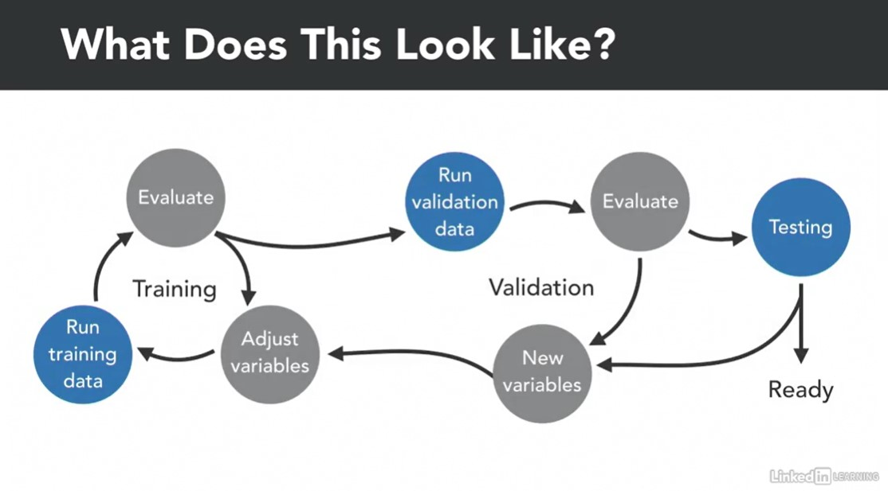
Basic workflow of training, validating, and testing your model

What are the risks of not splitting up the full dataset?
- Overfitting or underfitting to the data
- Which can lead to an inaccurate representation of how the model will generalize

### [Split Data for Train/Validation/Test Set](https://www.linkedin.com/learning/applied-machine-learning-foundations/split-data-for-train-validation-test-set?autoAdvance=true&autoSkip=true&autoplay=true&resume=false)

Work for this section done in the notebook in the [exercise section](foundations/03_Evaluation/03_02/Start/03_02.ipynb)

### [What is Cross-Validation?](https://www.linkedin.com/learning/applied-machine-learning-foundations/what-is-cross-validation?autoAdvance=true&autoSkip=true&autoplay=true&resume=false)

- **Holdout Test Set:** 
  - A generalization of the test set that we've been talking about
  - Any data set that was not used in fitting a model
  - Sample of data not used in fitting a model; used to evaluate the model's ability to generalize to unseen data

- **K-Fold Cross-Validation:**
  - Data is divided into `k` subsets and the holdout method is repeated `k` times
  - Each time, one of the `k` subsets is used as the test set and the other `k`- 1 subsets are combined to be used to train the model
  - This is another tool that is really helpful to gauge a model's ability to generalize to unseen examples

  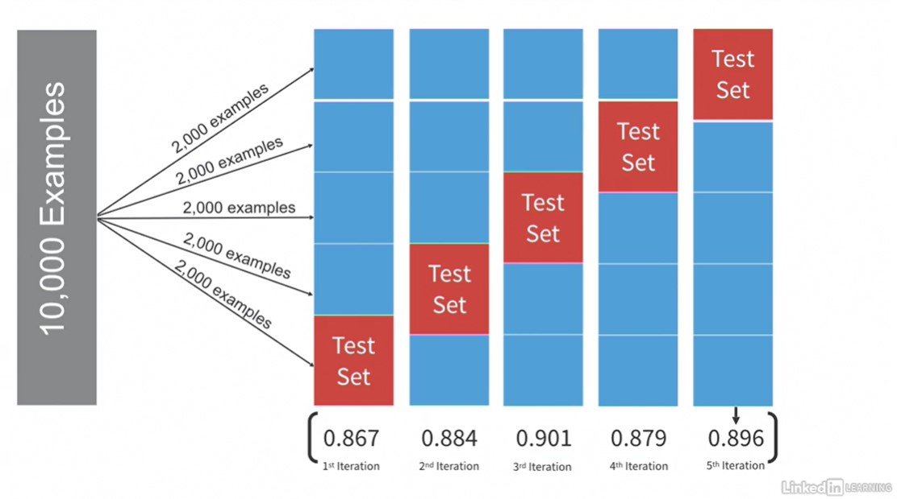
  - In this example `k = 5`
  - We have `5` subsets of data and each has `2,000` examples
  - There is no duplication in any of the subsets, all values are accounted for
  - All subsets will maintain the same data through the whole process
  - What happens during each iteration?
    - One of the subsets gets assigned as the test set, depending on what iteratation we are currently on
    - A new model is fit on the `4` current training sets
    - The model is then evaluated with the test set
    - The performance metric is recorded for that iteration
  - After the final iteration, you can output the full array of stored scores or just an average of all the scores

### [Establishing an Evaluation Framework](https://www.linkedin.com/learning/applied-machine-learning-foundations/establish-an-evaluation-framework?autoAdvance=true&autoSkip=true&autoplay=true&resume=false)

**Two Components of Evaluation Framework**
1. **Evaluation Metrics:**
   - How are we gauging the accuracy of the model?
   - What is the quantitative measure of performance that we're going to use?
   - For our Titanic dataset:
     - This is what is called a classification problem
     - We are just making a binary prediction
     - We will use the following three metrics:
       - Accuracy = # predicted correctly / total # of examples
       - Precision = # predicted as surviving that survived / total # predicted to survive
         - What percentage of the model's predictions were correct based on total number of all survived predictions
       - Recall = # predicted as surviving that survived / total # that survived
         - What percentage of the model's predictions were correct based on the true number of true survivors
       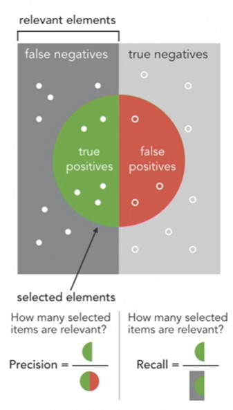

2. **Process (How to Split the Data):**
   - How do we leverage our full dataset to mitigate the likelihood of overfitting or underfitting?
   - Both of which will affect the model's ability to generalize

    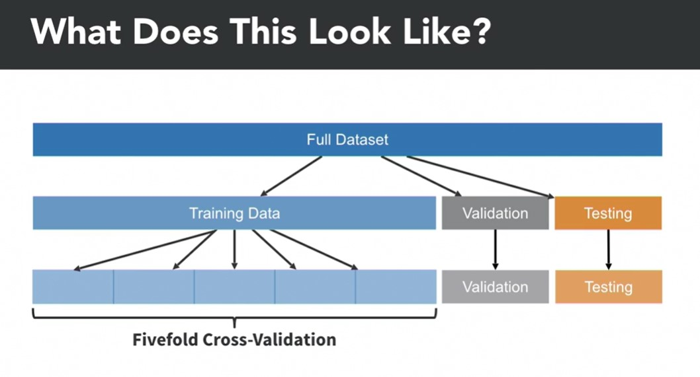

   1. Run fivefold cross-validation and select the best models
   2. Re-fit models with the chosen hyperparameter settings on full training set, evaluate those models on the validation set and pick the best one
   3. Evaluate that best model on the test set to gauge its ability to generalize to unseen data

### [Chapter Quiz](https://www.linkedin.com/learning/applied-machine-learning-foundations/quiz/urn:li:learningApiAssessment:4584875?autoAdvance=true&autoSkip=true&autoplay=true&resume=false)

Model performance on the training set matters more than performance on the validation set or test set.

- [ ] TRUE

- [x] FALSE

Scikit-learn's train_test_split method is capable of splitting a single dataset into three data subsets.

- [ ] TRUE

- [x] FALSE

How many individual models will be built in standard 10-fold Cross-Validation?

- [ ] 3

- [x] 10

- [ ] 5

- [ ] 1

Which is NOT a commonly used performance metric for classification problems?

- [ ] accuracy

- [ ] precision

- [ ] recall

- [x] cross-validation

## Optimizing a Model

### [Bias / Variance Tradeoff](https://www.linkedin.com/learning/applied-machine-learning-foundations/bias-variance-tradeoff?autoAdvance=true&autoSkip=true&autoplay=true&resume=false)

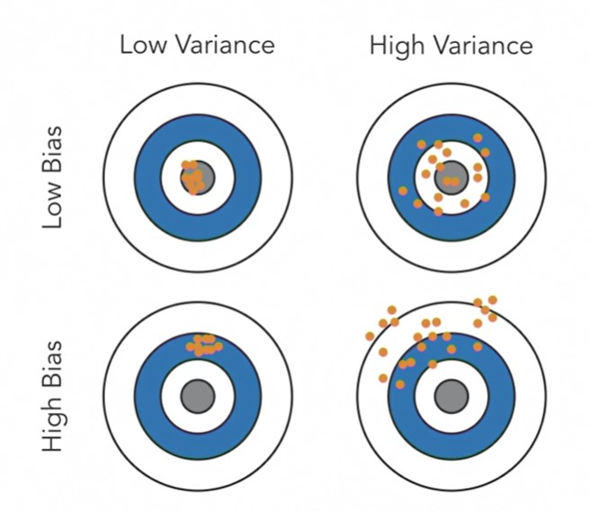

**Low Bias / Low Variance (Top Left):**
- Centered around the bullseye and constantly hitting the bullseye

**Low Bias / High Variance (Top Right):**
- You are centered around the bullseye but you are not constantly actually hitting the bullseye
- Low Bias: You are centered around the target
- High Variance: you are spread out and not constantly hitting whatever you're aiming for

**High Bias / Low Variance (Bottom Left):**
- You're not centered around the bullseye but the darts are fairly concentrated

**High Bias / High Variance (Bottom Right):**
- You are not centered around the bullseye and you are spread out

**Bias:** The algorithm's tendency to consistently learn the wrong thing by not taking into account all the information in the data.

**High Bias:** A result of the algorithm missing the relevant relations between features and target outputs.

**Variance:** Refers to an algorithm's sensitivity to small fluctuations in the training set.

**High Variance:** A result of the algorithm fitting to random noise in the training data.
- The model is very highly tuned to the data it has seen already but it does very poorly on examples that look nothing like what it has seen before

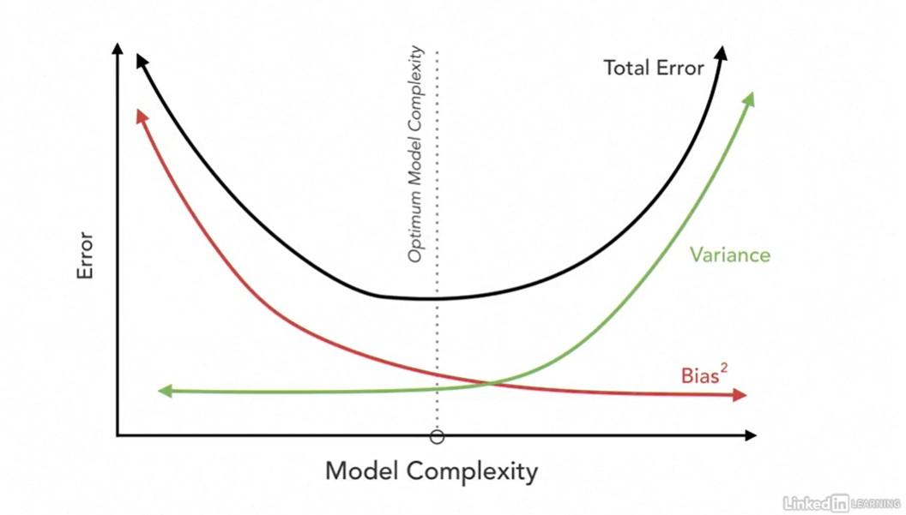

**Model Complexity:** Across the `x` axis
- Complex on the RIGHT
- Simple on the LEFT

**Model Error:** On the `y` axis

**Teal Line:** Represents the ***Variance***
- It consistently increases as the model gets more complex
- More Complexity = More Variance

**Red Line:** Represents the ***Bias***
- It decreases as the model gets more complex
- Less Complexity = High Bias

**Black Line:** Represents the ***Total Error***
- Very high for both a very simple model and a very complex model
- It bottoms out somewhere in the middle where the vertical line indicates ***Optimum Model Complexity***
- Total Error = (Bias + Variance) + Irreducible Error
  - **Irreducible Error:** Some amount of error that the model will never be able to learn
    - Such as randomness, noise, or however you want to define it
  - The part of this equation that we control is the bias and variance and by reducing those, we can reduce the total error

**Bias/Variance Tradeoff:** Finding the right model complexity that minimizes both bias and variance as much as possible.

### [What is Underfitting?](https://www.linkedin.com/learning/applied-machine-learning-foundations/what-is-underfitting?autoAdvance=true&autoSkip=true&autoplay=true&resume=false)

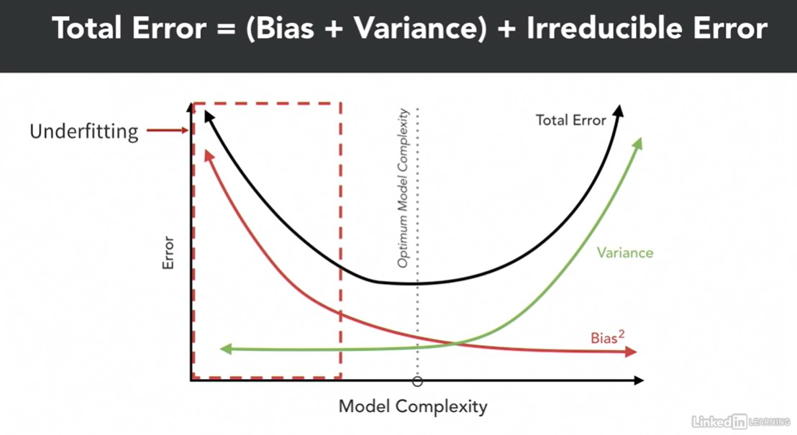

**Underfitting:** Low complexity model with high bias and low variance, which results in high total error
- Occurs when an algorithm can not capture the underlying trend of the data

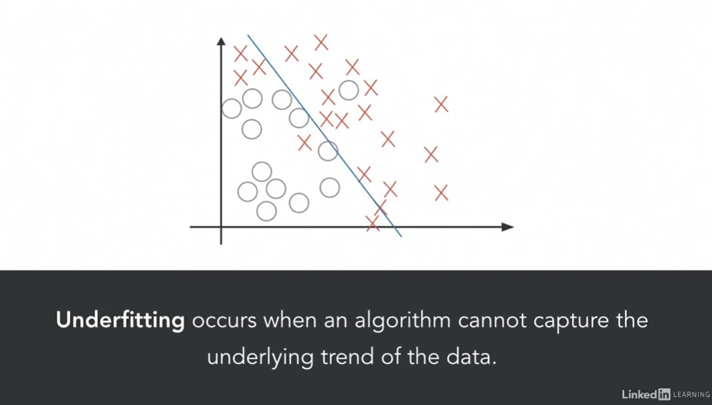

### [What is Overfitting?](https://www.linkedin.com/learning/applied-machine-learning-foundations/what-is-overfitting?autoAdvance=true&autoSkip=true&autoplay=true&resume=false)

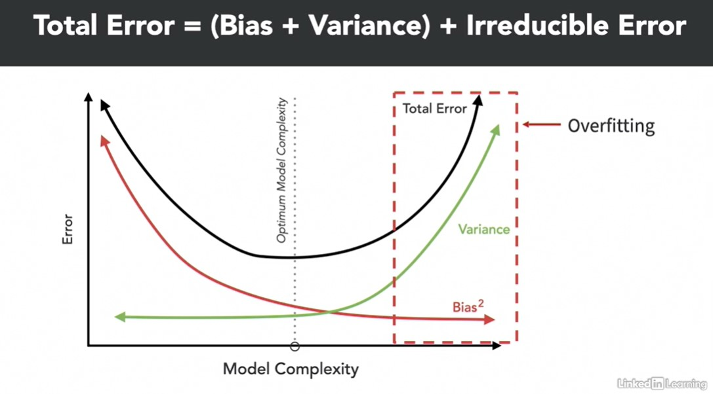

**Overfitting:** High complexity model with low bias and high variance, which results in high total error
- Occurs when an algorithm fits too closely to a limited set of data

  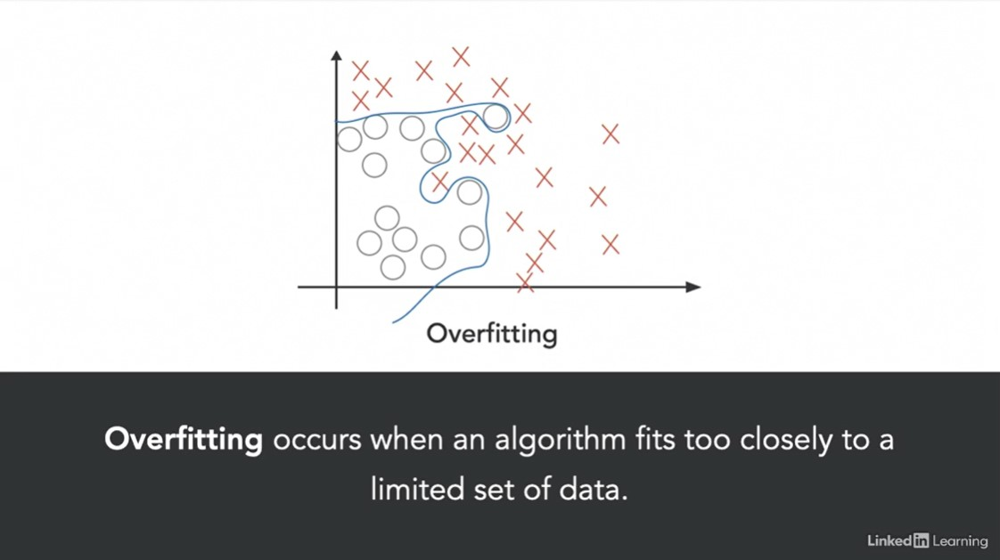
  - This is an example of a highly complex model
  - We can see that there is a very complex decision boundary
  - This model has fit very closely to the training data
  - It's very likely that this isn't the real pattern that it should be learning
  - Instead, it's just memorizing these examples
  - As a result, the model will have a very hard time generalizing to unseen data

### [Finding Optimal Tradeoff](https://www.linkedin.com/learning/applied-machine-learning-foundations/finding-the-optimal-tradeoff?autoAdvance=true&autoSkip=true&autoplay=true&resume=false)

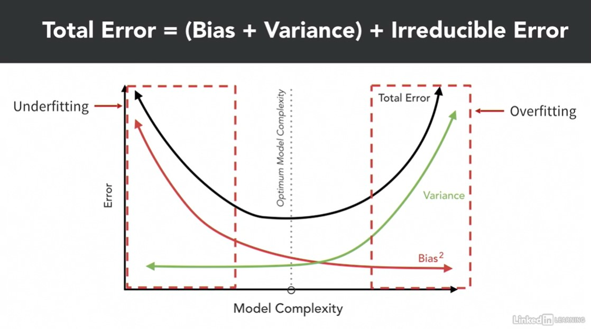
In this image we see that we have ***underfitting*** on the left and ***overfitting*** on the right. Then in the middle there is this line that says "***Optimum Model Complexity***". This is the optimal tradeoff we are trying to achieve.

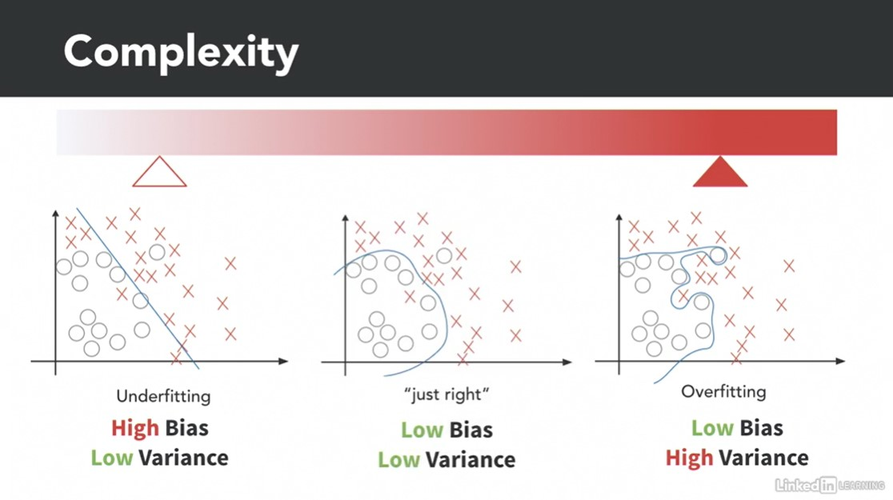
Here we are looking at it in a different way, on a scale of complexity.
- On the right is our very simple model 
  - It will underfit our data and won't learn the true pattern 
  - It has high bias and low variance
- On the other extreme (left side) is our overly complex model
  - This model is overfitting
  - It is essentially just memorizing the training set
  - It has low bias and high variance
- The goal is to find something in the middle
  - This would have some kind of medium complexity
  - It would learn the true pattern in the data with this "curved" decision boundary
  - However, it won't memorize every example in the training data
  - It would have low (not minimum) bias and low variance

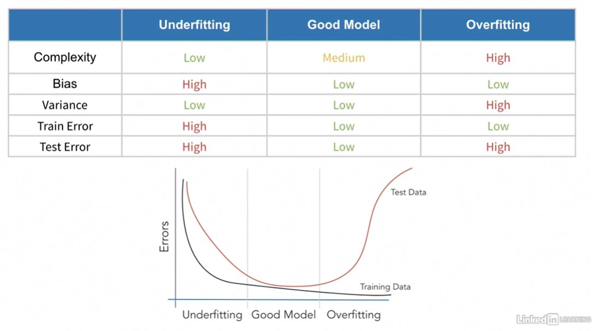
The best way to diagnose overfit vs underfit:
- Typically, you'll really only look at the test error
- If you see a low test error, generally that means you have a good model
- If you have high test error, you can look at the training error to really understand whether you're overfitting or you're underfitting
- Then you can work from there to improve your model

### [Hyperparameter Tuning](https://www.linkedin.com/learning/applied-machine-learning-foundations/hyperparameter-tuning?autoAdvance=true&autoSkip=true&autoplay=true&resume=false)

Two Primary Ways to Tune a Model for Optimal Complexity:

1. **Hyperparameter Tuning:** Choosing a set of hyperparameters for fitting an algorithm

2. **Regularizarion:** Technique used to reduce overfitting by discouraging overly complex models in some way

**Parameter:** A configuration variable that is internal to the model and whose value can be estimated from the data.

**Hyperparameter:** A configuration that is external to the model, whose value cannot be estimated from data, and whose value guides how the algorithm learns parameter values from the data.

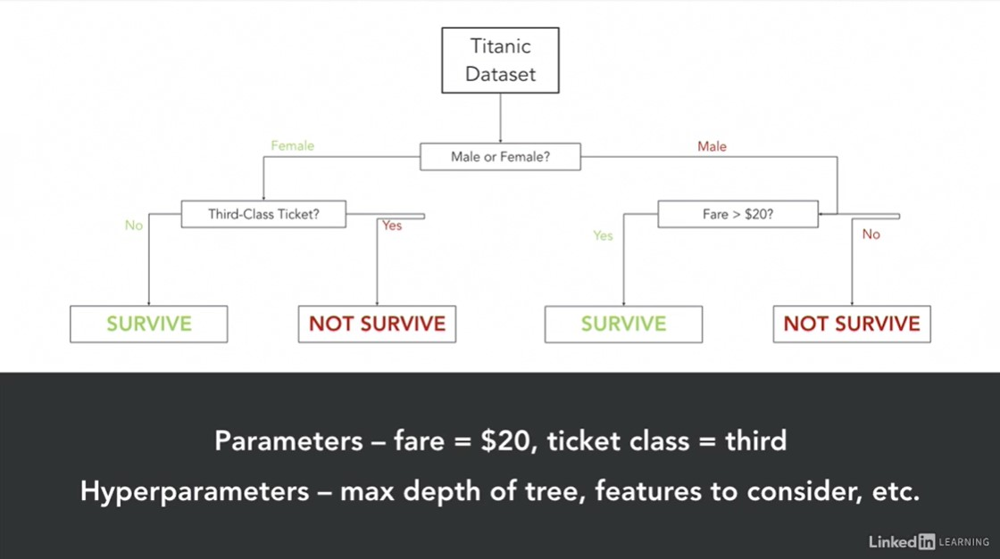

### [Regularization](https://www.linkedin.com/learning/applied-machine-learning-foundations/regularization?autoAdvance=true&autoSkip=true&autoplay=true&resume=false)

The ultimate goal of Regularization:
- Allow enough flexibility for the algorithm to learn the underlying patterns in the data but provide guardrails, so it doesn't overfit

**Occam's Razor:** Whenever possible, chose the simplest answer to a problem.
- Not specific to machine learning
- In our case, choose the simplest model to make accurate predictions
- Don't overcomplicate things!

Examples of Regularization:

- **Ridge Regression and Lasso Regression:**
  - Adding a penalty to the loss function to constrain coefficients
  - In other words, model performance needs to improve a lot in order for the method of regularization to allow the model to become more complex

- **Dropout:**
  - Used in deep learning
  - Some nodes are ignored during training which forces the other nodes to take on more or less responsibility for the input/output

### [Chapter Quiz](https://www.linkedin.com/learning/applied-machine-learning-foundations/quiz/urn:li:learningApiAssessment:4586349?autoAdvance=true&autoSkip=true&autoplay=true&resume=false)

The goal of model optimization is to tune model complexity to minimize total error by reducing variance and bias.

- [x] TRUE

- [ ] FALSE

Which is NOT a characteristic of underfitting?

- [ ] low variance

- [ ] high bias

- [ ] not capturing underlying trend in data

- [x] memorizing training examples

Which is NOT a characteristic of overfitting?

- [ ] low bias

- [x] not capturing underlying trend in data

- [ ] high variance

- [ ] memorizing training examples

If test error is high, what is the best tool to determine whether you're underfitting or overfitting?

- [ ] number of features

- [x] training error

- [ ] time to train

Which is NOT true of a hyperparameter?

- [ ] It is external to a model.

- [ ] It guides how the algorithm learns.

- [x] It is learned from data.

Which is NOT true of regularization when applied appropriately?

- [ ] improves model's ability to generalize

- [x] improves models performance on training data

- [ ] reduces overfitting

- [ ] reduces the complexity of a model

## End-to-End Pipeline

